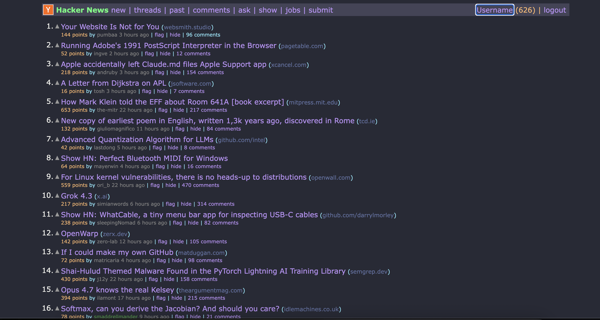

# Dracula Dark Theme for Hacker News

A dark theme for Hacker News inspired by the Dracula color palette
(https://github.com/dracula/hacker-news). This extension provides an
eye-friendly interface for browsing stories and comments.

## 📸 Preview

    

## Installation

1. Clone or download this repository.
2. Open Chrome and navigate to `chrome://extensions/`.
3. Enable **Developer mode** in the top right corner.
4. Click **Load unpacked** and select the project folder.